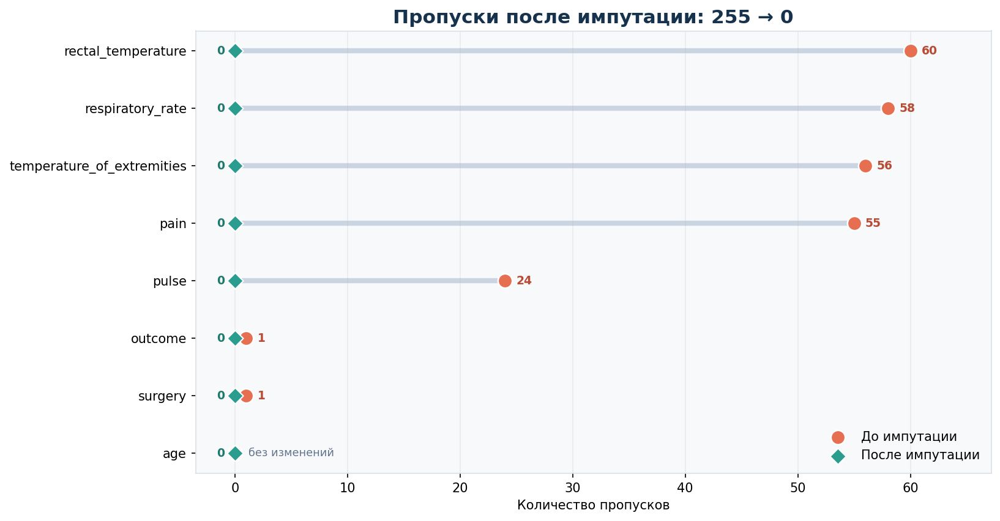
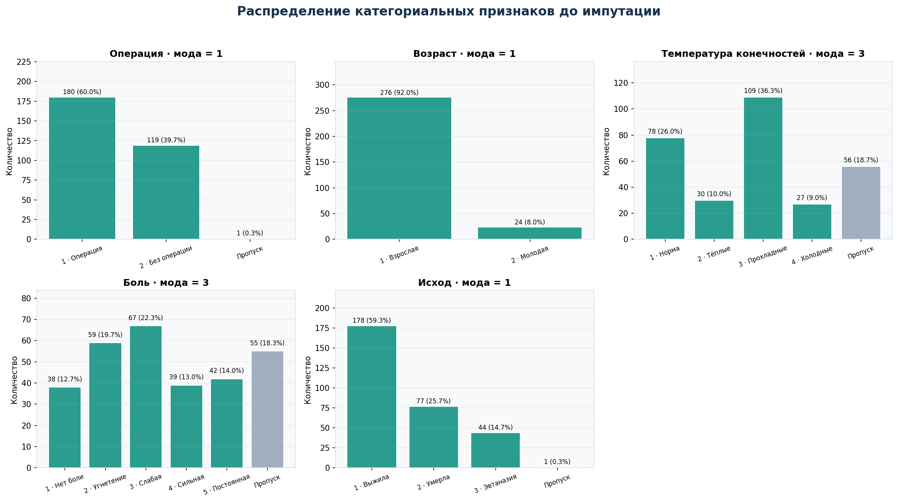
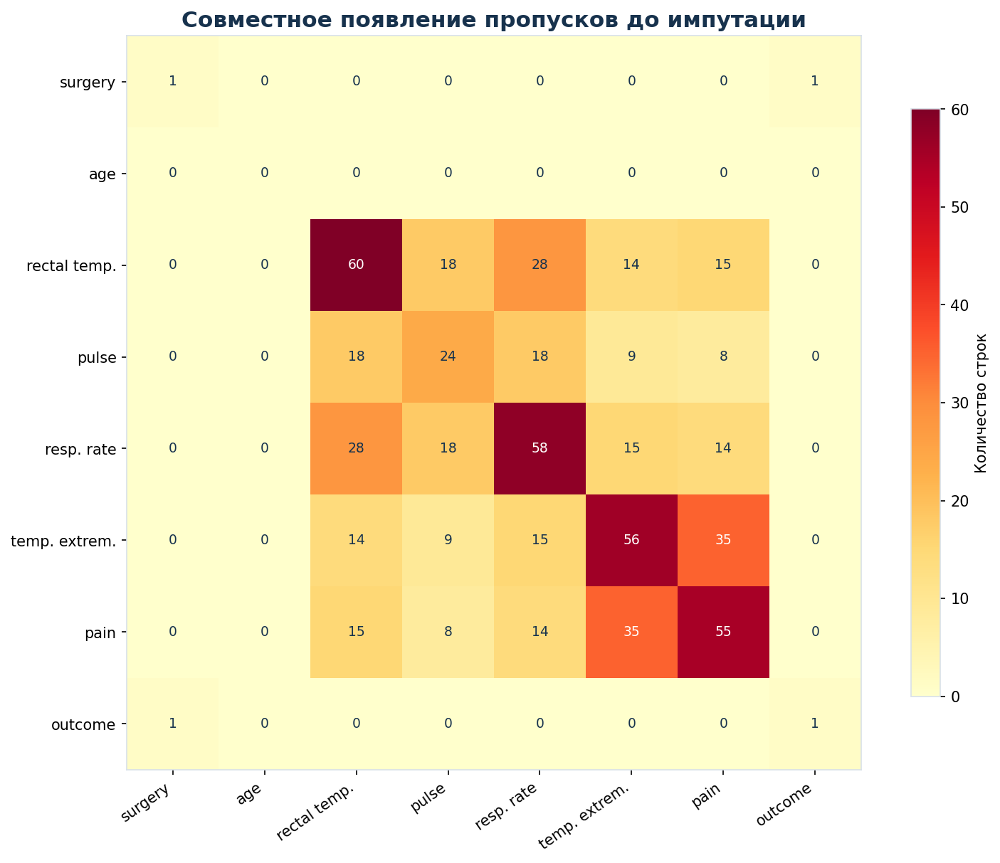
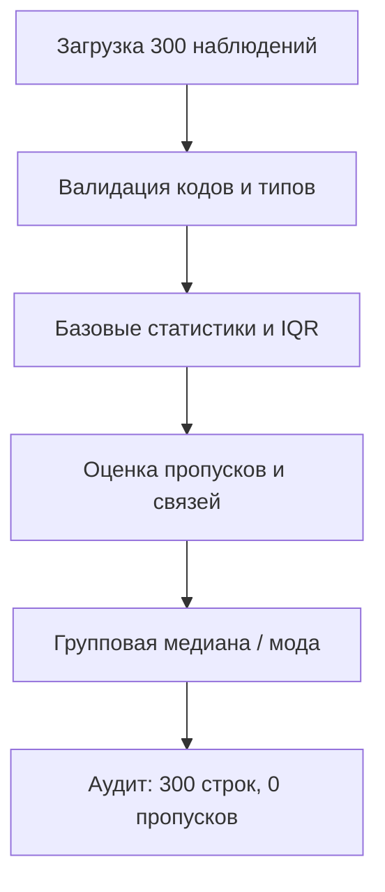

# Horse Colic: анализ качества данных

EDA, поиск аномалий и обоснованная импутация пропущенных значений в клиническом датасете.

> **English summary:** Exploratory analysis of the UCI Horse Colic dataset focused on category validation, clinically plausible outliers, missingness co-occurrence, and transparent group-wise median/tie-aware mode imputation.

| Наблюдения | Признаки | Пропуски до | Строки с IQR-выбросами | Пропуски после |
|---:|---:|---:|---:|---:|
| 300 | 8 | 255 | 33 | **0** |



Оранжевая точка показывает число пропусков до обработки, зелёный ромб — после неё. Для каждого признака результат после импутации равен нулю.

## Задача

Исходный набор содержит категориальные и непрерывные клинические признаки с большим числом пропусков. Цель проекта:

1. Валидировать коды и типы выбранных признаков.
2. Рассчитать базовые статистики и найти IQR-выбросы.
3. Отличить статистически крайние значения от подтверждённых ошибок.
4. Выбрать простые и интерпретируемые методы импутации.
5. Получить датафрейм без потери строк и без пропусков.

Основной анализ находится в [portfolio notebook](horse_colic_eda_portfolio.ipynb).

## Данные

**Horse Colic** — мультивариативный набор UCI Machine Learning Repository с категориальными, целочисленными и непрерывными признаками. Полная версия содержит 368 наблюдений; в проекте используется обучающая часть из 300 строк и 8 из 28 исходных полей.

| Признак | Тип | Смысл |
|---|---|---|
| `surgery` | категориальный | операция / лечение без операции |
| `age` | категориальный | взрослая / молодая лошадь |
| `rectal_temperature` | непрерывный | ректальная температура, °C |
| `pulse` | непрерывный | частота сердечных сокращений |
| `respiratory_rate` | непрерывный | частота дыхания |
| `temperature_of_extremities` | категориальный | субъективная оценка периферического кровообращения |
| `pain` | категориальный | субъективная оценка боли |
| `outcome` | категориальный | выжила / умерла / эвтаназия |

Полное описание полей сохранено в [`data/horse_data.names.txt`](data/horse_data.names.txt).

## Анализ категориальных признаков

Для `surgery`, `age`, `temperature_of_extremities`, `pain` и `outcome` добавлена отдельная проверка:

- `unique()` — сопоставление наблюдаемых кодов с описанием датасета;
- `mode()` — определение наиболее частой категории;
- `value_counts(dropna=False)` — частоты категорий и пропусков.

До коррекции `value_counts()` показывает для `age` **276 значений `1` и 24 значения `9`**, а допустимый по описанию код `2` отсутствует. Это делает допущение `9 → 2` проверяемым и явно отделяет ошибку кодирования категории от числового выброса.

| Признак | Допустимые коды | Мода | Частота моды | Пропуски | Недопустимые коды |
|---|---|---:|---:|---:|---|
| `surgery` | 1, 2 | 1 | 180 (60,0%) | 1 | нет |
| `age` | 1, 2 | 1 | 276 (92,0%) | 0 | нет после `9 → 2` |
| `temperature_of_extremities` | 1, 2, 3, 4 | 3 | 109 (36,3%) | 56 | нет |
| `pain` | 1, 2, 3, 4, 5 | 3 | 67 (22,3%) | 55 | нет |
| `outcome` | 1, 2, 3 | 1 | 178 (59,3%) | 1 | нет |



После коррекции `age` все наблюдаемые категориальные коды соответствуют описанию датасета.

Числовые коды здесь используются как метки. Поэтому среднее, дисперсия и стандартное отклонение для категориальных столбцов содержательно не интерпретируются; порядок кодов, включая `pain`, используется для отображения, но расстояние между соседними кодами не считается измеренной клинической разницей.

## Структура пропусков

Проверка по строкам дополняет доли пропусков по столбцам:

| Пропусков в строке | Строк |
|---:|---:|
| 0 | 154 |
| 1 | 77 |
| 2 | 47 |
| 3 | 12 |
| 4 | 2 |
| 5 | 8 |

**69 строк** содержат не менее двух пропусков. Поэтому удаление всех неполных наблюдений привело бы к заметной потере данных.



## Методология



Для непрерывных признаков выбрана медиана: распределения не прошли проверку на нормальность, а в данных есть крайние значения. Для категориальных признаков используется мода.

| Признак | Пропуски | Метод заполнения |
|---|---:|---|
| `surgery` | 1 | мода по `pain` |
| `age` | 0 | валидация кодов; `9 → 2` как явно обозначенное допущение |
| `rectal_temperature` | 60 | медиана по `age` |
| `pulse` | 24 | медиана по `age + surgery` |
| `respiratory_rate` | 58 | медиана по `pulse + age`; резерв — медиана по `age` |
| `temperature_of_extremities` | 56 | единственная мода по `pulse`; при ничьей или отсутствии наблюдений — общая мода |
| `pain` | 55 | мода по `surgery + outcome` |
| `outcome` | 1 | мода по `pain` |

Для категориальной импутации используется отдельное правило: групповая мода принимается только тогда, когда она единственная. В 10 группах `pulse` для `temperature_of_extremities` обнаружено несколько равноправных мод; это затронуло 8 строк с пропусками. В итоге 41 значение заполнено однозначной групповой модой, а 15 — общей модой. По сравнению с автоматическим выбором `mode().iloc[0]` итог изменился в 7 заполняемых строках; ни одно исходно зарегистрированное значение не менялось.

## Ключевые результаты

- В анализируемой матрице было **255 пропусков**, или 10,6% ячеек.
- Проверка пяти категориальных признаков не выявила недопустимых кодов после коррекции `age: 9 → 2`; для каждого столбца рассчитаны мода и распределение частот.
- Анализ совместных пропусков показал 154 полностью заполненные строки и 69 строк минимум с двумя пропусками.
- IQR выделил **36 крайних значений в 33 строках**. Они не удалены: клинический контекст допускает тяжёлые состояния с высокими пульсом и частотой дыхания.
- Тест Шапиро отверг гипотезу о нормальности для всех трёх непрерывных признаков.
- Между `pulse` и `respiratory_rate` наблюдается умеренная положительная связь: **Spearman ρ = 0,47**.
- Все **300 строк сохранены**, в итоговом датафрейме нет пропусков.
- Категориальные признаки в итоговом наборе имеют целочисленный тип `int64`.
- Обработанный набор сохранён в [`data/horse_data_imputed.csv`](data/horse_data_imputed.csv).

## Контроль воспроизводимости

| Проверка | Результат |
|---|---:|
| Строк после обработки | 300 |
| Выбранных признаков | 8 |
| Пропусков до / после | 255 / 0 |
| Недопустимых категориальных кодов | 0 |
| Изменённых исходно наблюдаемых значений | 0 |
| Автоматических проверок качества пройдено | все |

## Ограничения

- `age: 9 → 2` — обоснованное допущение на основе допустимых кодов, но оно не может быть сверено с первичной картой.
- Медианная и модальная импутация снижает вариативность и может усиливать доминирующие категории.
- Использование `outcome` для импутации `pain` приемлемо для этой описательной задачи, но при прогнозе `outcome` станет утечкой целевой переменной.
- Точные группы `pulse` иногда малы, поэтому потребовались резервные правила; минимальный размер группы-донора как отдельный порог надёжности не задавался.
- Числовые коды категорий являются метками, а не измерениями; арифметические операции над ними не используются для содержательных выводов.
- Это учебно-аналитический проект, а не клиническая система поддержки решений.

## Запуск

```bash
python -m venv .venv
source .venv/bin/activate        # Windows: .venv\Scripts\activate
pip install -r requirements.txt
jupyter lab horse_colic_eda_portfolio.ipynb
```

Запускать notebook нужно из корня проекта. В Google Colab можно загрузить `horse_data.csv` в `/content/`; ячейка поиска данных поддерживает оба сценария.

## Структура проекта

```text
horse-colic-eda-portfolio/
├── README.md
├── horse_colic_eda_portfolio.ipynb
├── requirements.txt
├── assets/
│   ├── categorical_distributions.png
│   ├── continuous_distributions.png
│   ├── data_quality_overview.png
│   ├── imputation_effect.png
│   ├── iqr_outliers.png
│   ├── missing_values_before.png
│   ├── missingness_cooccurrence.png
│   └── pulse_respiratory_relationship.png
└── data/
    ├── README.md
    ├── horse_data.csv
    ├── horse_data.names.txt
    └── horse_data_imputed.csv
```

## Технологии

- Python
- pandas / NumPy
- SciPy
- Matplotlib
- Jupyter Notebook

## Возможные продолжения

- Оценить методы импутации через искусственное маскирование известных значений.
- Сравнить групповую импутацию с KNN или Iterative Imputer внутри кросс-валидации.
- Построить отдельный leakage-safe pipeline для прогноза `outcome`.

## Источник и лицензия данных

McLeish, M. & Cecile, M. (1989). *Horse Colic* [Dataset]. UCI Machine Learning Repository. [https://doi.org/10.24432/C58W23](https://doi.org/10.24432/C58W23).

Датасет опубликован под лицензией [CC BY 4.0](https://creativecommons.org/licenses/by/4.0/). Исходные авторы и источник указаны выше.
